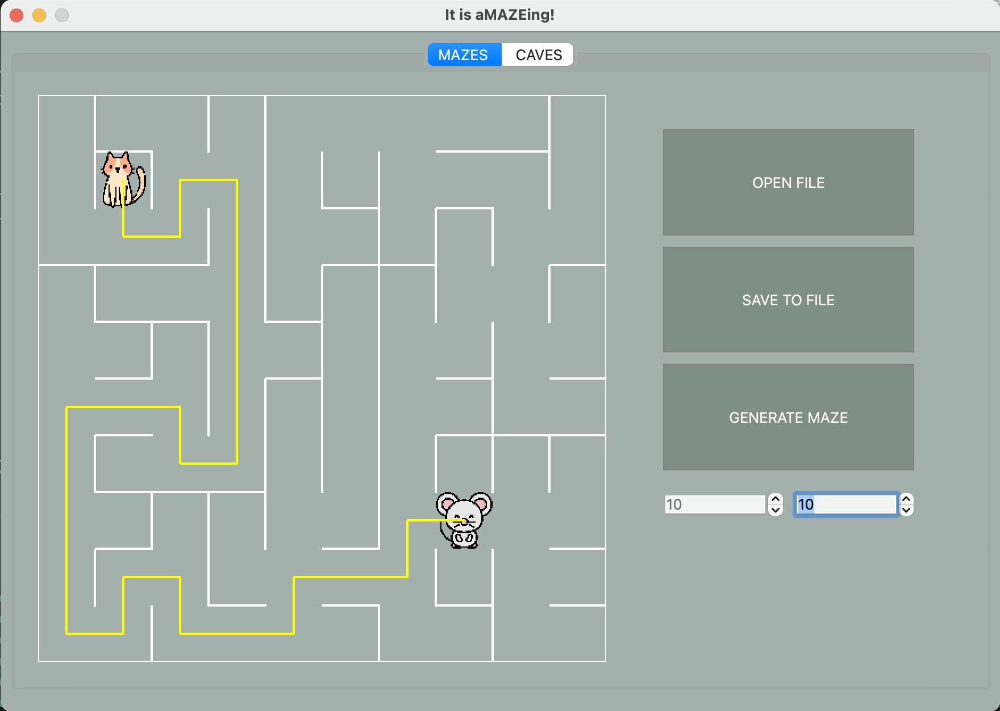
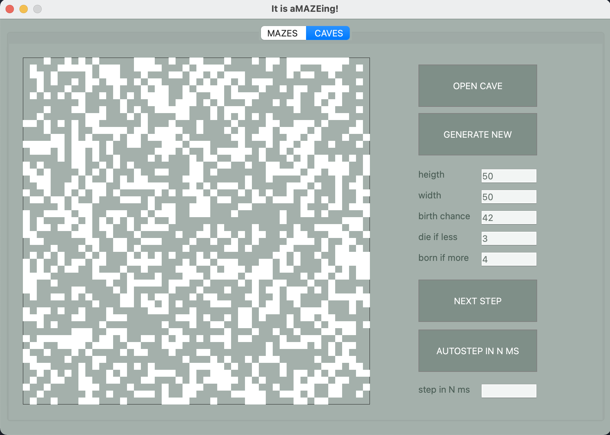

# Maze

Реализация проекта Maze, знакомство с основными алгоритмами их обработки лабиринтов и пещер, такими как: генерация, отрисовка, поиск решения.

## Описание лабиринта

Лабиринт может храниться в файле в виде количества строк и столбцов, а также двух матриц, содержащих положение вертикальных и горизонтальных стен соответственно. 
В первой матрице отображается наличие стены справа от каждой ячейки, а во второй - снизу. 

Пример подобного файла:  
```
4 4
0 0 0 1
1 0 1 1
0 1 0 1
0 0 0 1

1 0 1 0
0 0 1 0
1 1 0 1
1 1 1 1
```


## Описание пещер

Пещера, прошедшая 0 шагов симуляции (только инициализированная), может храниться в файле в виде количества строк и столбцов, 
а также матрицы, содержащей положение "живых" и "мертвых" клеток.

Пример подобного файла:
```
4 4
0 1 0 1
1 0 0 1
0 1 0 0
0 0 1 1
```

## Part 1. Реализация проекта Maze

Реализация программы Maze, позволяющая генерировать и отрисовывать идеальные лабиринты и пещеры:

- В программе  реализован графический пользовательский интерфейс на базе QT для C++
- В программе предусмотрена кнопка для загрузки лабиринта из файла, который задается в формате, описанном [выше](#описание-лабиринта) 
- Максимальный размер лабиринта - 50х50
- Загруженный лабиринт отрисовывается на экране в поле размером 500 x 500 пикселей
- Толщина "стены" - 2 пикселя
- Размер самих ячеек лабиринта вычисляется таким образом, чтобы лабиринт занимал всё отведенное под него поле

## Part 2. Генерация идеального лабиринта

Добавление возможности автоматической генерации идеального лабиринта. \
Идеальным считается лабиринт, в котором из каждой точки можно попасть в любую другую точку ровно одним способом.

- Генерация лабиринта происходит согласно **алгоритму Эллера**
- В сгенерированном лабиринте нет изолированных областей и петель
- Пользователем вводится только размерность лабиринта: количество строк и столбцов
- Сгенерированный лабиринт сохраняется в файл в формате, описанном [выше](#описание-лабиринта) 
- Созданный лабиринт должен отображаться на экране как указано в [первой части](#part-1-реализация-проекта-maze)

## Part 3. Решение лабиринта



Добавление возможности показать решение _любого_ лабиринта, который сейчас изображен на экране:
- Пользователем задаются начальная и конечная точки
- Маршрут, являющийся решением, отображается линией толщиной 2 пикселя, проходящей через середины всех ячеек лабиринта, через которые пролегает решение
- Цвет линии решения должен быть отличным от цветов стен и поля

## Part 4. Бонус. Генерация пещер



Добавление генерации пещер с [использованием клеточного автомата](#генерация-с-использованием-клеточного-автомата)(пещера может быть загружена из файла либо сгенерирована рандомно исходя из заданных пользователем параметров):

- Пользователем выбирается файл, в котором описан пещера по описанному [выше](#описание-пещер) формату
- Для отображения пещер используется отдельная вкладка пользовательского интерфейса
- Максимальный размер пещеры - 50 х 50
- Загруженная пещера отрисовывается на экране в поле размером 500 x 500 пикселей
- Пользователем задаются пределы "рождения" и "смерти" клетки, а также шанс на начальную инициализацию клетки
- Пределы "рождения" и "смерти" могут иметь значения от 0 до 7
- Клетки за границей пещеры считаются живыми
- Предусмотрен пошаговый режим отрисовки результатов работы алгоритма в двух вариантах:
  - По нажатию кнопки **следующего шага** отрисовывается очередная итерация работы алгоритма
  - По нажатию кнопки **автоматической работы** запускается отрисовка итераций работы алгоритма с частотой 1 шаг в `N` миллисекунд, где число миллисекунд `N` задаётся через специальное поле в пользовательском интерфейсе
- Размер клеток в пикселях вычисляется таким образом, чтобы пещера занимала всё отведенное под него поле


 Данный проект является групповым, я отвечала за разработку классов, связанные с чтением лабиринта из файла, генерация идеального лабиринта, поиск решения, а также чтение пещер из файла. Немного участвовала в процессе отрисовки.
